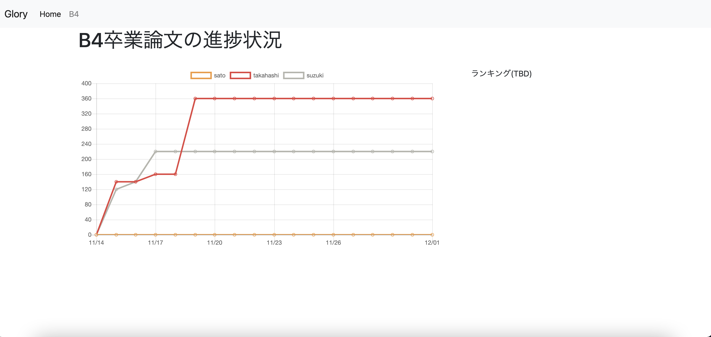

# glory

Google Driveにある学位論文の原稿(docx)の進捗状況を表示する。

## バージョン
go1.15.5

依存パッケージは`go.mod`を参照

## ディレクトリ構成
```
glory/          # 設定や、定数などの情報
  ├ golang      # golang のソースコード
  ├ assets/     # 図とか
  ├ docker/     # dockerの設定
  └ web/        # HTTPサーバ
```

## 使い方

1. 設定ファイルの記述
   1. `config.json` で設定する. 設定方法は `config.json.tmpl` を参照。 `dir` は論文があるディレクトリを指定する.
   2. `.env.tmpl`  を参考に `.env`を作り, `MYSQL_ROOT_PASSWORD`, `MYSQL_USER`, `MYSQL_PASSWORD`, `DSN` を設定する.
   3. `Makefile` の `APP_HOST` の値を glory を稼働させるサーバに設定する．このサーバは ~/.ssh/config の Name である.

2. プログラムのビルド，デプロイ
   1. golang/ において
       ```
      $ make build
       ```
   2. / において
       ```
      $ make deploy_full
       ```

3. プログラムの稼働
   1. glory が稼働する予定のサーバの /opt/glory で
       ```
      $ docker-compose up -d
       ```

4. データ取得の設定 
   1. `google-drive-ocamlfuse` を使用して GoogleDrive のそれぞれのディレクトを `/opt/glory/mnt/b4`, `/opt/glory/mnt/m2` にマウントする．
   2. glory が稼働する予定のサーバで crontab を編集し，定期的に /opt/glory/bin/count_char が実行されるようにする


## 画面例


